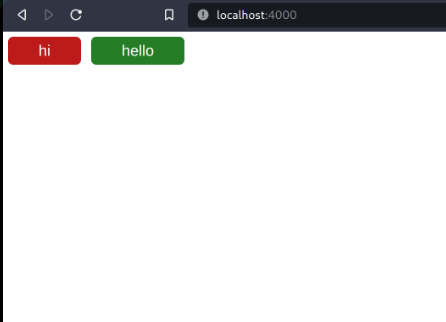

# web

Example client app that fetches JSON from API

## Files

- main.js

  queries the Node.js server for JSON and renders the buttons using JavaScript

- index.html

  main HTML entrypoint

- style.css

  CSS for the index.html. makes the buttons a certain color based on state from JSON

- Caddyfile

  Configuration for [Caddy](https://caddyserver.com/), a web server (as an alternative to Nginx, Apache, etc.). Follow the docs to install it

  If using windows, I recommend installing Caddy with [Scoop](https://scoop.sh/)

  also because of pathing nonsense with windows, recommend using the open source powershell instead of the built-in windows one. Get it [here](https://github.com/PowerShell/PowerShell)

  Caddy is being used to host the web files and to proxy requests from `/api` to the node.js server. This is because browsers don't always like when you make a request to a different origin (in this case, the Node server, which is at http://localhost:3000), for security reasons. So it's just easier to have the web server proxy the requests for us, and then the frontend just queries `/api`, and doesnt actually care what that means. You can change where that goes with a web server config changer rather than a code change.

- server

  a Node.js server. Node.js is a server-side JavaScript runtime. There are tons of versions of Node.js since they do LTS for several major versions. So you'll need a way to make sure you're on a specific version. Easiest way to do that is with Node Version Manager (nvm), which you can get from Scoop: `scoop install nvm`

  To have nvm use Node 16, run `nvm install 16`. If you're opening a new terminal instance, this version will be reset, so run `nvm use 16`. Check node version with `node -v`. Or if you are in the server folder, you can skip worrying about the exact version and then run `nvm install` and it will read the `.nvmrc` file and install the right version. If you don't specify a version, it will use the latest version of Node, which might break things depending on the version, as the Node devs like the make breaking changes on major versions (semver). So in case the API changed, just trying to get you on the same version I used to develop this, but it probably doesnt matter.

  then you can run the server with `node index.mjs`. This is a replacement for whatever your real server happens to be and is just an example. It just returns some hard-coded JSON

## Running it

`cd` into `server` and run `node index.mjs`

then in another terminal instance run `caddy run` at the project root

Then go to [http://localhost:4000](http://localhost:4000) in your browser. You will see buttons.

## For fun I guess

Flip the `state` keys in the JSON in `server/index.mjs` from `0` or `1` then restart the node server and reload the page, and you should see the colors change, since the colors are based on that state key.
